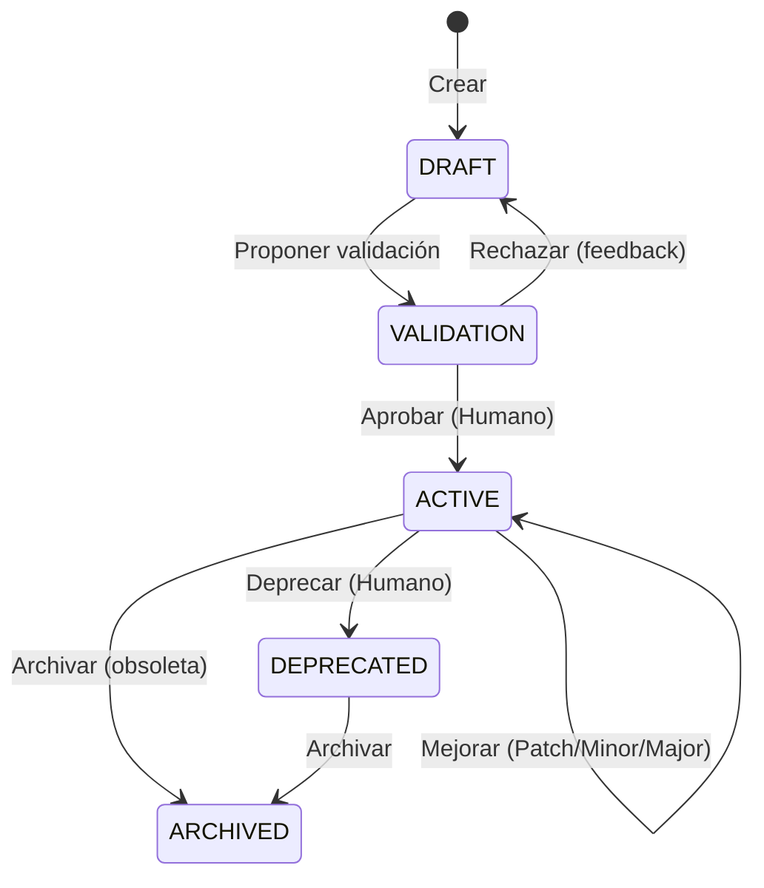

# SAQI-003: Gobernanza y Ciclo de Vida de Skills

**Versión:** 1.0
**Fecha:** 2026-07-17
**Estado:** Borrador inicial
**Autor:** Adónis Adonai Gómez Martínez

---

## 1. Definición Formal de Skill

> Una **Skill** en SAQI es un **artefacto de conocimiento de ingeniería versionado, gobernado y comprobable** que codifica reglas, procedimientos, patrones, plantillas y criterios de verificación para un dominio específico de la ingeniería de software, de modo que un agente de IA pueda aplicarlo consistentemente y un humano pueda validarlo, mejorarlo y reutilizarlo entre proyectos.

**Una Skill NO es:**
- Un simple prompt o instrucción en lenguaje natural
- Un snippet de código sin contexto ni reglas
- Documentación pasiva sin criterios de verificación ejecutables

**Una Skill SÍ es:**
- Un archivo estructurado (Markdown + frontmatter YAML) con secciones obligatorias
- Versionada semánticamente (SemVer)
- Gobernada por un proceso de ciclo de vida
- Comprobable mediante tests de contrato y escenarios
- Trazable a defectos, iteraciones y decisiones

---

## 2. Estructura Canónica de una Skill

Toda Skill SAQI **DEBE** tener la siguiente estructura:

```markdown
---
# FRONTMATTER OBLIGATORIO (YAML)
name: "skill-name"                    # kebab-case, único
version: "1.2.0"                      # SemVer
level: "A"                            # A | B | C | D
category: "coding-standards"          # taxonomy category
status: "active"                      # active | deprecated | archived | draft
author: "team/org"                    # autor/organización
created: "2026-01-15"                 # ISO 8601
updated: "2026-07-10"                 # ISO 8601
depends_on: []                        # lista de skills requeridas
conflicts_with: []                    # skills incompatibles
tags: ["typescript", "react", "clean-code"]
validation:
  automated: true                     # tiene tests automatizados
  contract_tests: "tests/skills/skill-name.contract.test.ts"
  scenario_tests: "tests/skills/skill-name.scenario.test.ts"
  lint_rules: "eslint-plugin-skill-name"
---

# {{name}} v{{version}} — {{category}} (Nivel {{level}})

## 1. Propósito y Alcance
Descripción clara de QUÉ dominio cubre y PARA QUÉ sirve.

## 2. Referencias Normativas
Estándares, specs, RFCs, papers que fundamentan las reglas.
- OWASP ASVS 4.0.3 §V5
- CERT SECURE CODING INT30-C
- ISO/IEC 25010:2011
- RFC 7519 (JWT)

## 3. Reglas Obligatorias (MUST / SHALL)
Reglas que **TODO código** bajo esta Skill debe cumplir.
Expresadas como afirmaciones verificables.
Ejemplos:
- MUST: Todas las funciones públicas tienen JSDoc con @param @returns
- SHALL: No usar `any` sin justificación documentada en comment `// @ts-expect-error`
- MUST: Validar TODAS las entradas en boundary (puertos/adaptadores)

## 4. Reglas Recomendadas (SHOULD)
Buenas prácticas fuertemente recomendadas pero con excepciones justificables.

## 5. Anti-Patrones Prohibidos (MUST NOT)
Patrones que introducen defectos conocidos.
- MUST NOT: Lógica de negocio en componentes React
- MUST NOT: `console.log` en producción
- MUST NOT: Transacciones DB fuera de repositorios

## 6. Patrones Aprobados (PATTERNS)
Plantillas de código reutilizables con placeholders tipados.
```typescript
// PATTERN: Repository Interface (Domain Port)
export interface {{Entity}}Repository {
  findById(id: {{IdType}}): Promise<Result<{{Entity}}, DomainError>>;
  save(entity: {{Entity}}): Promise<Result<void, DomainError>>;
  // ...
}
```

## 7. Procedimientos Paso a Paso (PROCEDURES)
Guías para tareas recurrentes.
### 7.1 Cómo implementar un nuevo Caso de Uso
1. Definir puerto en `domain/ports/`
2. Implementar adaptador en `infrastructure/adapters/`
3. Crear caso de uso en `application/use-cases/`
4. Tests: Contract + Unit + Integration

## 8. Criterios de Verificación (VERIFICATION)
Checklists automatizables para validar cumplimiento.
### 8.1 Linting / Static Analysis
- `eslint-plugin-skill-name` rules
- `tsc --noEmit` strict mode
### 8.2 Contract Tests
- `tests/skills/skill-name.contract.test.ts`
### 8.3 Scenario Tests
- `tests/skills/skill-name.scenario.test.ts`

## 9. Plantillas de Código (TEMPLATES)
Archivos starter con placeholders para scaffolding.
Ubicación: `templates/skill-name/`

## 10. Ejemplos Validados (EXAMPLES)
Código real de proyectos que cumple la Skill (referencia).

## 11. Known Limitations / Trade-offs
Limitaciones conocidas, decisiones de diseño, debt técnico aceptado.

## 12. Changelog
### [1.2.0] - 2026-07-10
#### Added
- Regla MUST: Validación Zod en todos los puertos de entrada (DEF-1245)
#### Changed
- Plantilla Repository actualizada a Result pattern v2
#### Fixed
- Anti-patrón: Excepción silenciosa en `save()` corregida

## 13. Métricas de Efectividad (Opcional)
- `defect_prevention_rate`: % defectos tipo X prevenidos tras regla Y
- `adoption_rate`: % proyectos usando skill
- `false_positive_rate`: % alertas skill que son falsos positivos
```

---

## 3. Taxonomía de Skills (Niveles A-D)

### Nivel A: Fundamentales / Obligatorias (Core)
**Aplicables a TODO proyecto SAQI.** No opcionales.

| Skill ID | Nombre | Dominio | Referencia Normativa Principal |
|----------|--------|---------|-------------------------------|
| `A-coding-standards` | Estándares de Código | Clean Code, TypeScript, React | Martin (Clean Code), TypeScript Handbook |
| `A-project-architecture` | Arquitectura de Proyecto | Clean/Hexagonal, ADRs, C4 | Martin (Clean Architecture), Cockburn (Hexagonal) |
| `A-secure-coding` | Programación Segura | OWASP, CERT, NIST SSDF | OWASP Top 10, ASVS, CERT, NIST 800-218 |
| `A-context-manager` | Gestión de Contexto | Context Engineering, Checkpointing | Liu et al. (RAG), Voyager (Skill Library) |
| `A-testing` | Testing Automatizado | Pirámide, Cuadrantes, Mutation, PBT | Cohn (Pyramid), Crispin (Quadrants), Jia & Harman (Mutation) |
| `D-git-workflow` | Git Workflow | Conventional Commits, Branching, PRs | GitFlow, Trunk-Based Development |

### Nivel B: Dominio / Tecnología (Domain-Specific)
**Seleccionadas según stack y dominio del proyecto.**

| Skill ID | Nombre | Dominio | Aplicabilidad |
|----------|--------|---------|---------------|
| `B-authentication-security` | Autenticación Segura | Auth, RBAC, JWT, Offline | Apps con auth |
| `B-database-design-sql` | Diseño BD SQL | PostgreSQL, MySQL, Migraciones | Backend con SQL |
| `B-database-design-offline` | Diseño BD Offline | IndexedDB, Dexie, Sync, CRDT | Offline-first apps |
| `B-dexie-patterns` | Patrones Dexie.js | IndexedDB wrapper patterns | Apps Dexie/IndexedDB |
| `B-erp-offline` | ERP Offline Patterns | Módulos ERP, Sync, Audit | ERP offline |
| `B-html-css` | HTML Semántico + CSS | Semantic HTML, Tailwind, Design Systems | Frontend web |
| `B-javascript-clean` | JavaScript Limpio | ES2024+, Patterns, Functional | JS/TS projects |
| `B-ui-components` | Componentes UI | Radix, Tailwind, Compound, Accessible | React UI libs |

### Nivel C: Verificación / Debugging (Verification)
**Obligatorias en fases de verificación (5, 6, 7, 8, 10).**

| Skill ID | Nombre | Dominio | Fase SAQI |
|----------|--------|---------|-----------|
| `C-debugging` | Debugging Estructurado | Zeller, RR, Hypothesis-driven | 8, 9 |
| `C-documentation` | Documentación Técnica | ADRs, API Docs, User Guides | 12, 13 |
| `C-qa-breaker` | QA Adversarial | Chaos, Security, Stress, A11y | 7 |

### Nivel D: Soporte / Mantenimiento (Support)
**Mejora continua del sistema SAQI.**

| Skill ID | Nombre | Dominio | Uso |
|----------|--------|---------|-----|
| `D-prompt-engineering` | Prompt Engineering | CoT, Few-shot, Structured Output | Fase 4, 14 |
| `D-agent-ia` | Agent IA Architecture | ReAct, Planning, Tool Use, Loops | Meta-skill |

---

## 4. Ciclo de Vida de una Skill (Governance Process)



### 4.1 Etapas Detalladas

| Etapa | Actividades | Responsable | Criterios Entrada → Salida |
|-------|-------------|-------------|---------------------------|
| **DRAFT** | 1. Identificar necesidad (gap, defecto recurrente, nuevo dominio)<br>2. Escribir Skill completa (estructura canónica)<br>3. Crear tests contrato + escenario<br>4. Crear plantillas/templates<br>5. Documentar referencias normativas | Humano (Experto dominio) | Entrada: Necesidad identificada<br>Salida: Skill completa en `draft/` con tests passing |
| **VALIDATION** | 1. Revisión técnica par (otro experto)<br>2. Prueba en proyecto real (mínimo 1 iteración)<br>3. Métricas: defectos prevenidos, falsos positivos, adopción<br>4. Feedback humano + agente<br>5. Decisión: Aprobar / Revisar / Rechazar | Humano (Gobernanza) + Agente (Métricas) | Entrada: Draft + tests + prueba real<br>Salida: Aprobada → ACTIVE v1.0.0 / Rechazada → DRAFT |
| **ACTIVE** | 1. Uso en proyectos<br>2. Monitoreo métricas efectividad<br>3. Mejora continua (Fase 14 SAQI)<br>4. Versionado SemVer por cambios | Humano (Gobernanza) | Entrada: Aprobada v1.0.0<br>Salida: Versiones publicadas, changelog, tags git |
| **DEPRECATED** | 1. Marcar en frontmatter `status: deprecated`<br>2. Documentar razón y migración en CHANGELOG<br>3. Mantener 1 versión mayor para migración<br>4. Comunicar a proyectos usuarios | Humano (Gobernanza) | Entrada: Skill obsoleta/superada/dañina<br>Salida: Deprecated + Guía migración |
| **ARCHIVED** | 1. Mover a `archived/`<br>2. Eliminar de catálogo activo<br>3. Mantener historial git | Humano (Gobernanza) | Entrada: Deprecated + período gracia agotado<br>Salida: Archivado, solo historial |

---

## 5. Versionado Semántico (SemVer) para Skills

| Tipo Cambio | Versión | Ejemplo | Trigger Típico |
|-------------|---------|---------|----------------|
| **PATCH** | `1.2.3 → 1.2.4` | Fix typo en regla, clarificación, ajuste plantilla, fix test skill | Corrección sin cambio semántico |
| **MINOR** | `1.2.3 → 1.3.0` | Nueva regla SHOULD, nuevo patrón, nueva plantilla, nuevo procedimiento | Funcionalidad compatible hacia atrás |
| **MAJOR** | `1.2.3 → 2.0.0` | Regla MUST cambiada/eliminada, anti-patrón añadido/removido, breaking change en plantillas/templates | Incompatible con versiones anteriores |

**Regla:** Todo cambio en Skill ACTIVE **DEBE** generar entrada en CHANGELOG con trazabilidad a:
- Defecto DEF-XXX (prevención)
- Iteración ITER-XXX (origen)
- Decisión ADR-XXX (arquitectura)

---

## 6. Testing de Skills (Verificación de la Skill misma)

Una Skill **DEBE** ser comprobable. Tests obligatorios:

### 6.1 Contract Tests (`*.contract.test.ts`)
Verifican que las **reglas MUST/SHALL** se pueden validar automáticamente.

```typescript
// tests/skills/A-coding-standards.contract.test.ts
import { RuleTester } from 'eslint';
const rule = require('../../.opencode/skill/A-coding-standards/rules/no-any-without-justification');

const tester = new RuleTester({ parserOptions: { ecmaVersion: 2022 } });

tester.run('no-any-without-justification', rule, {
  valid: [
    { code: 'const x: number = 1;' },
    { code: 'const x: any = 1; // @ts-expect-error Justificación: lib externa sin types' },
  ],
  invalid: [
    { code: 'const x: any = 1;', errors: [{ messageId: 'unjustifiedAny' }] },
  ],
});
```

### 6.2 Scenario Tests (`*.scenario.test.ts`)
Verifican que los **procedimientos y plantillas** producen código correcto.

```typescript
// tests/skills/B-dexie-patterns.scenario.test.ts
import { generateRepository } from '../../.opencode/skill/B-dexie-patterns/templates/repository';

test('generateRepository produce código que compila y pasa contract tests', async () => {
  const code = generateRepository({ entity: 'Product', idType: 'string' });
  // 1. TypeScript compile check
  // 2. ESLint con skill rules
  // 3. Ejecutar tests generados contra Dexie real
});
```

### 6.3 Métricas de Efectividad de Skill (Runtime)

| Métrica | Definición | Objetivo |
|---------|------------|----------|
| `defect_prevention_rate` | Defectos tipo X evitados / Defectos tipo X totales históricos | > 80% para reglas MUST |
| `false_positive_rate` | Alertas skill incorrectas / Total alertas | < 10% |
| `adoption_rate` | Proyectos usando skill / Proyectos aplicables | > 90% Nivel A |
| `time_to_fix_skill_gap` | Tiempo desde detección gap → Skill actualizada | < 2 iteraciones |

---

## 7. Catálogo de Skills (Registro Maestro)

Ubicación: `.opencode/skill/registry.yaml`

```yaml
skills:
  - id: "A-coding-standards"
    version: "2.1.0"
    status: "active"
    path: ".opencode/skill/A-coding-standards/"
    tests:
      contract: "tests/skills/A-coding-standards.contract.test.ts"
      scenario: "tests/skills/A-coding-standards.scenario.test.ts"
    last_validated: "2026-07-01"
    effectiveness:
      defect_prevention_rate: 0.87
      false_positive_rate: 0.05
  - id: "B-dexie-patterns"
    version: "1.3.0"
    status: "active"
    # ...
```

---

## 8. Prevención de Propagación de Errores en Skills

**Riesgo:** Una Skill incorrecta (regla errónea, plantilla con bug) se propaga a múltiples proyectos.

**Mitigaciones SAQI:**

| Capa | Medida |
|------|--------|
| **Diseño** | Reglas basadas en estándares normativos (OWASP, CERT, ISO), no opiniones |
| **Validación** | Prueba obligatoria en proyecto real antes de ACTIVE |
| **Testing** | Contract tests + Scenario tests automatizados en CI |
| **Versionado** | SemVer estricto; MAJOR = breaking change requiere migración documentada |
| **Monitoreo** | Métricas de efectividad por skill (false positives, prevention rate) |
| **Gobernanza** | Humano experto aprueba cada versión; Deprecación rápida si dañina |
| **Aislamiento** | Skills versionadas por proyecto (`SKILL_SELECTION.md` fija versiones) |
| **Rollback** | `git revert` skill version → proyectos usan versión anterior hasta fix |

---

## 9. Métricas de Gobernanza (Para SAQI-007)

| Métrica | Fórmula | Frecuencia |
|---------|---------|------------|
| **Skill Currency** | % Skills ACTIVE con versión ≤ 6 meses | Mensual |
| **Skill Coverage** | Skills Nivel A aplicables / Skills Nivel A totales | Por proyecto |
| **Skill Defect Contribution** | Defectos causados por Skill errónea / Total defectos | Por iteración |
| **Skill Improvement Rate** | Skills modificadas / Skills activas | Por iteración |
| **Time to Skill Fix** | Tiempo medio gap detectado → Skill patcheada | Continuo |

---

## 10. Referencias Internas

- SAQI-001: Resumen Ejecutivo (Taxonomía resumen)
- SAQI-004: Marco QA (Skill C-qa-breaker detalle)
- SAQI-005: Proceso SAQI (Fase 3, 14 detalle)
- SAQI-007: Marco Métricas (Métricas efectividad)
- SAQI-018: Apéndice B - Plantillas Configuración Agente (Ejemplos Skills)

---

## 11. Referencias Externas

1. Semantic Versioning 2.0.0 - semver.org
2. IEEE 828-2012 - Configuration Management
3. ISO/IEC 19770-2:2015 - Software Identification Tags
4. NIST SP 800-218 (SSDF) - PW.4, PW.5, RV.1, RV.2 (Secure coding practices, vulnerability remediation)
5. OWASP SAMM (Software Assurance Maturity Model) - Governance, Design, Verification