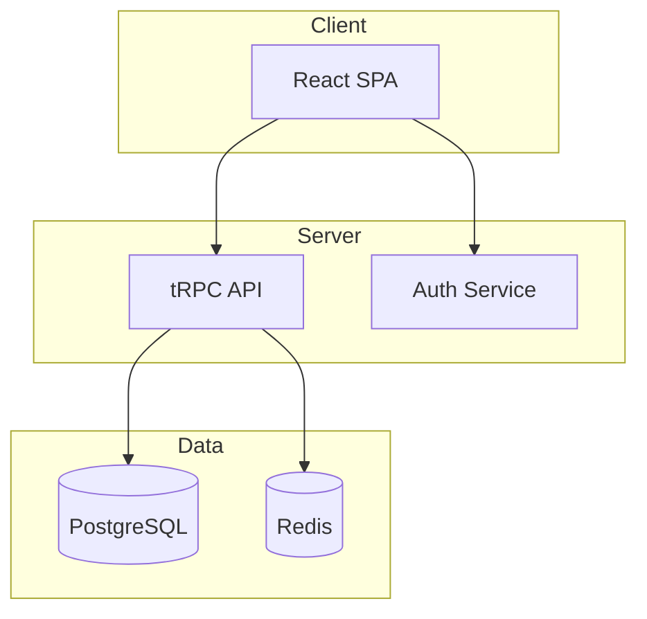
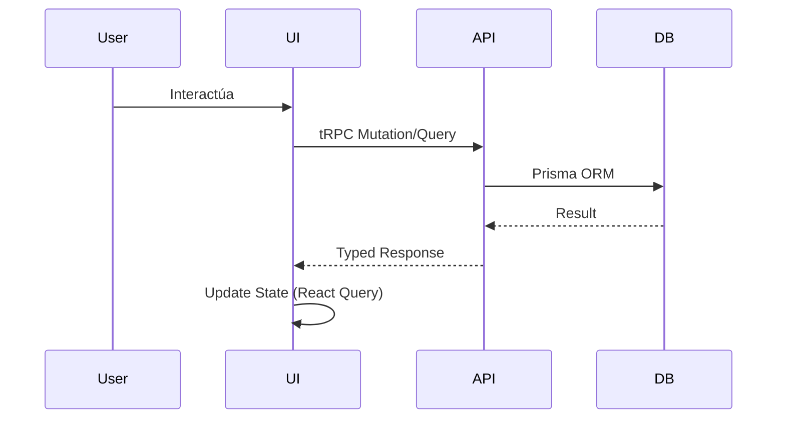

# SAQI-018: Apéndice B — Plantillas de Configuración de Agente

**Versión:** 1.0
**Fecha:** 2026-07-17
**Estado:** Borrador inicial
**Autor:** Adónis Adonai Gómez Martínez

---

## 1. saqi.agent.yaml — Configuración Principal del Agente

```yaml
# saqi.agent.yaml
# Configuración del agente SAQI para un proyecto específico
# Ubicación: raíz del proyecto / .saqi/

project:
  name: "my-project"
  root: "."
  stack:
    language: "typescript"
    runtime: "node"
    modules: "esm"
    ui: "react"           # react | vanilla | vue | svelte | none
    db: "postgresql"      # postgresql | mysql | sqlite | indexeddb | none
    orm: "prisma"         # prisma | drizzle | dexie | typeorm | none
    test_unit: "vitest"
    test_e2e: "playwright"
    test_adversarial: ["playwright", "k6", "zap", "axe-core"]
    build: "vite"
    package_manager: "npm"

agent:
  model:
    provider: "opencode"        # opencode | anthropic | openai | local
    name: "default"             # modelo específico
    context_window: 100000
    checkpoint_threshold: 0.70   # resumen preventivo
    force_checkpoint_threshold: 0.80  # checkpoint obligatorio

  skills:
    registry_path: "~/.config/opencode/skills"
    project_skills_path: ".opencode/skill"   # overrides locales
    auto_load_level_a: true
    version_lock_file: "SKILL_SELECTION.md"

  modes:
    builder:
      skills: 
        - "A-coding-standards"
        - "A-project-architecture"
        - "A-secure-coding"
        - "B-javascript-clean"
      tools: ["fs", "shell", "linter", "test_runner:unit"]
      max_concurrent_tasks: 3

    test_engineer:
      skills: ["A-testing", "C-dexie-patterns"]
      tools: ["test_runner:unit", "test_runner:integration", "test_runner:e2e", "metrics"]
      max_concurrent_tasks: 2

    adversarial:
      skills: ["C-qa-breaker", "A-secure-coding", "A-testing", "B-authentication-security"]
      tools: ["test_runner:adversarial", "browser", "shell", "fs"]
      attack_categories: 
        - "ATK-SEC"
        - "ATK-INPUT"
        - "ATK-STATE"
        - "ATK-STRESS"
        - "ATK-CHAOS"
        - "ATK-CONC"
        - "ATK-REC"
        - "ATK-A11Y"
      max_concurrent_tasks: 1  # secuencial por seguridad

    analyst:
      skills: ["C-debugging"]
      tools: ["shell", "fs", "git"]
      max_concurrent_tasks: 1

    documenter:
      skills: ["C-documentation", "A-context-manager"]
      tools: ["fs", "shell"]
      max_concurrent_tasks: 1

  human_gates:
    - phase: 1; decision: "approve_plan"; required_roles: ["PO", "TL"]
    - phase: 2; decision: "approve_adrs"; required_roles: ["Architect", "TL"]
    - phase: 3; decision: "approve_skills"; required_roles: ["TL"]
    - phase: 4; decision: "code_review_critical"; required_roles: ["TL", "Security"]
    - phase: 7; decision: "release_gate_adversarial"; required_roles: ["QA Lead"]
    - phase: 8; decision: "validate_root_cause"; required_roles: ["TL", "QA"]
    - phase: 11; decision: "sign_off_release"; required_roles: ["PO", "TL", "QA Lead"]
    - phase: 14; decision: "approve_skill_changes"; required_roles: ["Skill Governor"]

  context_docs:
    - "ARCHITECTURE.md"
    - "CONTEXT.md"
    - "PROJECT_STATE.md"
    - "QA_RESULTS.md"
    - "SESSION.md"

  checkpoints:
    dir: ".saqi/checkpoints"
    max_checkpoints: 50
    compression_model: "lightweight-summarizer"

metrics:
  collector:
    enabled: true
    interval_ms: 5000
    exporters: ["prometheus", "csv", "json"]
  track:
    - "tokens_consumed"
    - "tool_calls"
    - "phase_durations"
    - "defects_found"
    - "tests_executed"
    - "coverage"
    - "mutation_score"
    - "context_usage_pct"
    - "checkpoint_count"
```

---

## 2. SKILL_SELECTION.md — Plantilla de Selección de Skills

```markdown
# SKILL_SELECTION.md — Iteración ITER-XXX

**Iteración:** ITER-005
**Fecha:** 2026-07-15
**Fase:** 3 (Skill Selection)
**Responsable:** Tech Lead

---

## Skills Nivel A (Obligatorias - 100%)

| Skill | Versión | Justificación | Estado |
|-------|---------|---------------|--------|
| A-coding-standards | v2.1.0 | Estándares base todo proyecto | ✅ Cargada |
| A-project-architecture | v1.0.0 | Clean/Hexagonal + ADRs | ✅ Cargada |
| A-secure-coding | v1.2.0 | OWASP + CERT + NIST SSDF | ✅ Cargada |
| A-context-manager | v1.1.0 | 4 docs vivos + checkpointing | ✅ Cargada |
| A-testing | v1.0.0 | Pirámide + cuadrantes + PBT + mutation | ✅ Cargada |
| A-qa-breaker | v1.0.0 | QA adversarial 8 categorías ATK-* | ✅ Cargada |

---

## Skills Nivel B (Dominio/Tecnología - Según Stack)

| Skill | Versión | Justificación | Estado |
|-------|---------|---------------|--------|
| B-javascript-clean | v1.0.0 | ES Modules, async/await, patterns | ✅ Cargada |
| B-ui-components | v1.0.0 | Componentes reutilizables (React) | ✅ Cargada |
| B-authentication-security | v1.0.0 | JWT, RBAC, PBKDF2, offline auth | ✅ Cargada |
| C-database-design-offline | v1.3.0 | IndexedDB/Dexie offline-first | ✅ Cargada |
| C-dexie-patterns | v1.1.0 | Repository pattern, transacciones | ✅ Cargada |
| D-erp-offline | v1.0.0 | Patrones ERP offline (módulos, sync) | ✅ Cargada |

---

## Skills Nivel C (Verificación - Fases 5,6,7,8,10,12)

| Skill | Versión | Justificación | Estado |
|-------|---------|---------------|--------|
| C-debugging | v1.0.0 | Debugging estructurado obligatorio | ✅ Cargada |
| C-documentation | v1.0.0 | Docs al final cuando todo verificado | ✅ Cargada |

---

## Skills Nivel D (Soporte - Transversales)

| Skill | Versión | Justificación | Estado |
|-------|---------|---------------|--------|
| D-prompt-engineering | v1.0.0 | CoT, few-shot, structured output | ✅ Cargada |

---

## Conflictos Detectados y Resueltos

| Skill A | Skill B | Conflicto | Resolución |
|---------|---------|-----------|------------|
| A-secure-coding (no innerHTML) | B-ui-components (algunos usan innerHTML legacy) | B-ui-components tiene componente legacy con innerHTML | ✅ Componente legacy marcado deprecated; nuevo componente usa DOM API |

---

## Versiones Lock (Inmutables para esta Iteración)

```yaml
skills_lock:
  A-coding-standards: "2.1.0"
  A-project-architecture: "1.0.0"
  A-secure-coding: "1.2.0"
  A-context-manager: "1.1.0"
  A-testing: "1.0.0"
  A-qa-breaker: "1.0.0"
  B-javascript-clean: "1.0.0"
  B-ui-components: "1.0.0"
  B-authentication-security: "1.0.0"
  C-database-design-offline: "1.3.0"
  C-dexie-patterns: "1.1.0"
  D-erp-offline: "1.0.0"
  C-debugging: "1.0.0"
  C-documentation: "1.0.0"
  D-prompt-engineering: "1.0.0"
```

---

## Aprobación

- **Tech Lead:** _________________________ Fecha: ___________
- **Orquestador:** _________________________ Fecha: ___________
```

---

## 3. ITERATION_PLAN.md — Plantilla de Plan de Iteración

```markdown
# ITERATION_PLAN.md — ITER-XXX

**Iteración:** ITER-005
**Fechas:** 2026-07-15 a 2026-07-26 (2 semanas)
**Responsable:** Tech Lead / Orquestador

---

## 1. Alcance (Backlog Items Seleccionados)

| ID | Historia de Usuario | Módulo | Puntos | Prioridad |
|----|---------------------|--------|--------|-----------|
| US-023 | Como usuario quiero generar reporte de ventas por rango de fechas | Reportes | 5 | Alta |
| US-024 | Como admin quiero configurar moneda e impuesto dinámicamente | Configuración | 3 | Alta |
| US-025 | Como vendedor quiero ver gráfico de ventas mensuales en Dashboard | Dashboard | 5 | Media |

---

## 2. Criterios de Aceptación (Testables)

### US-023: Reporte Ventas por Fechas
- [ ] AC1: Filtro por fecha inicio/fin (incluye día completo fin)
- [ ] AC2: Auto-generación al cambiar tab
- [ ] AC3: Resumen totales (ventas, items, ticket promedio)
- [ ] AC4: Exportar CSV/JSON
- [ ] AC5: Empty state si 0 resultados

### US-024: Configuración Moneda/Impuesto
- [ ] AC1: Símbolo moneda configurable (prefijo/sufijo)
- [ ] AC2: Tasa impuesto 0-100% (validación)
- [ ] AC3: Cambio dinámico sin recargar (actualiza toda UI)
- [ ] AC4: Persistencia en Settings + localStorage

### US-025: Dashboard Gráfico Ventas
- [ ] AC1: Gráfico barras últimos 12 meses
- [ ] AC2: Formato moneda configurable
- [ ] AC3: Responsive (mobile < 768px)
- [ ] AC4: Loading state mientras carga datos

---

## 3. Definition of Done (DoD) Iteración

- [ ] Todos ACs verificados por tests (Unit + Func + E2E)
- [ ] Coverage ≥ 80/75/80 (L/B/F), Mutation Score ≥ 70%
- [ ] 0 defectos P0/P1 abiertos
- [ ] QA Adversarial (Fase 7) completado 8/8 categorías ATK-*
- [ ] Regresión suite completa 100% pass
- [ ] Security gate: 0 vuln críticas/altas sin mitigar
- [ ] Performance: LCP < 2.5s, TBT < 200ms, CLS < 0.1
- [ ] Accesibilidad: 0 violations critical/serious (axe-core)
- [ ] Documentación actualizada (ARCHITECTURE, CONTEXT, PROJECT_STATE, QA_RESULTS)
- [ ] Sign-off: PO + TL + QA Lead

---

## 4. Riesgos Identificados

| Riesgo | Probabilidad | Impacto | Mitigación |
|--------|--------------|---------|------------|
| Chart.js conflict con CSP | Media | Alto | Configurar CSP nonce; probar en fase 6 |
| Date range edge cases (DST, leap year) | Alta | Media | Property-based tests en fase 5 |
| Configuración dinámica rompe caches | Media | Media | Invalidación explícita cache en Service |

---

## 5. Dependencias Técnicas

- Chart.js v4 ya instalado (assets/lib/chart.umd.min.js)
- SettingsService existe (US-012 completado iteración anterior)
- ReportService base existe (US-015 completado)

---

## 6. Métricas Objetivo Iteración

| Métrica | Objetivo |
|---------|----------|
| Cycle Time | ≤ 2 semanas |
| Defects Injected | ≤ 5 (P2/P3) |
| Defects Escaped (Adversarial) | 0 P0, 0 P1 |
| Human Interventions | ≤ 8 |
| Tokens/Iteration | ≤ 2.5M |
```

---

## 4. ARCHITECTURE.md — Plantilla Inicial

```markdown
# ARCHITECTURE — [Project Name]

**Versión:** 1.0.0
**Estado:** Draft / Active / Archived
**Última actualización:** YYYY-MM-DD

---

## 1. Stack Tecnológico

| Capa | Tecnología | Versión |
|------|------------|---------|
| UI | React 18 + TypeScript | 18.2.0 / 5.3.0 |
| Estado | Zustand / Redux Toolkit | 4.4.0 |
| API | tRPC / React Query | 10.0.0 / 5.0.0 |
| BD | PostgreSQL 15 + Prisma | 15.4 / 5.0.0 |
| Auth | NextAuth.js / JWT | 4.24.0 |
| Testing | Vitest + Playwright | 1.0.0 / 1.40.0 |
| CI/CD | GitHub Actions | — |

---

## 2. Arquitectura General (C4 Level 1-2)



---

## 3. Flujo de Datos



---

## 4. ADRs (Architecture Decision Records)

### ADR-001: [Título] — YYYY-MM-DD
**Contexto:** ...
**Decisión:** ...
**Consecuencias:** ...
**Alternativas:** ...
**Estado:** Accepted / Superseded by ADR-XXX

---

## 5. Contratos de Puertos (Domain Ports)

| Puerto | Interface | Implementación (Adapter) |
|--------|-----------|-------------------------|
| `UserRepository` | `findById, save, delete, findByEmail` | `PrismaUserRepository` |
| `AuthService` | `login, logout, refresh, getCurrentUser` | `JwtAuthService` |
| `EventBus` | `publish, subscribe` | `RedisEventBus` |

---

## 3. Diagramas (Mermaid/PlantUML)

### Contexto (Nivel 1)
```mermaid
...
```

### Contenedores (Nivel 2)
```mermaid
...
```

### Componentes (Nivel 3) - Por módulo
```mermaid
...
```

### Secuencia - Flujos Críticos
```mermaid
...
```
```

---

## 5. CONTEXT.md — Plantilla Inicial

```markdown
# [Project Name] — Contexto del Proyecto

## Stack
- **Lenguaje**: TypeScript 5.3 (ES Modules)
- **Framework UI**: React 18 + Vite
- **Base de Datos**: PostgreSQL 15 via Prisma ORM
- **Testing**: Vitest (unit/int), Playwright (E2E)
- **CI/CD**: GitHub Actions

## Arquitectura
Clean Architecture (Hexagonal) con puertos/adaptadores.
Regla: UI → Controller → Service → Repository → Prisma.
Prohibido saltarse capas.

## Módulos Funcionales (Objetivo)

| Módulo | Estado | Archivos Clave |
|--------|--------|----------------|
| Auth | 🔄 En progreso | AuthService, LoginController, LoginView |
| Users | ⏳ Pendiente | UserService, UserController, UserView |
| Products | ⏳ Pendiente | ... |
| ... | ... | ... |

## Utils Implementados
- `sanitizer.ts` — escapeHtml, stripTags, sanitizeObject
- `validators.ts` — composeValidators, validateEmail, validateRequired, etc.
- `helpers.ts` — debounce, generateId, deepClone, formatError
- `formatters.ts` — formatCurrency, formatDate, setCurrencySymbol
- `errors.ts` — AppError, ValidationError, NotFoundError

## Roles y Permisos (RBAC)

| Rol | Permisos |
|-----|----------|
| Admin | Todos (`*.*`) |
| User | `products.read`, `orders.create`, `profile.*` |

## Fixes Recientes (YYYY-MM-DD)
- **Fix descripción**: Causa → Solución → Archivos

## Convenciones Clave (Niveles A-D)
### Nivel A — Obligatorio Siempre
1. A-coding-standards — SOLID, DRY, KISS, 300 líneas/archivo, 40 líneas/función
2. A-project-architecture — Clean/Hexagonal, ADRs, DI
3. A-secure-coding — Sin innerHTML dinámico, sanitizar, validar capas
4. A-testing — AAA, FIRST, casos borde, mocks

### Nivel B — Cuando Aplica
5. B-authentication-security — PBKDF2, RBAC, mínimo privilegio
6. B-html-css — HTML semántico, CSS variables, responsive mobile-first
7. B-javascript-clean — ES Modules, const/let, async/await
8. B-ui-components — Componentes reutilizables, separation of concerns

### Nivel C — Debugging (Al Finalizar)
9. C-debugging — 1. Causa → 2. Explicar → 3. Proponer → 4. Implementar → 5. Verificar (tests 0 fallos)

### Nivel D — Documentación (Al Final)
10. C-documentation — Solo cuando código verificado. Sin comentarios en código.

## Patrones
- Repository encapsula Prisma, Service lógica negocio, Controller orquesta, View renderiza
- DI manual en `main.tsx` / `App.tsx`
- Transacciones Prisma en Services para operaciones multi-tabla
- Result<T, E> pattern para manejo errores (nunca throw para control flow)
```

---

## 6. PROJECT_STATE.md — Plantilla Inicial

```markdown
# [Project Name] — Estado del Proyecto

## Estado General
Proyecto en fase inicial. Arquitectura definida. Módulo Auth en progreso.

---

## Arquitectura
[Referencia a ARCHITECTURE.md]

---

## Módulos Terminados

| Módulo | Service | Controller | View | Tests |
|--------|---------|------------|------|-------|
| Auth | 5 métodos | 2 métodos | 2 vistas | 7 service + 2 controller |

---

## Mejoras Recientes
- **Fix descripción**: Causa → Solución → Archivos

---

## Estructura de Carpetas
[Ver ARCHITECTURE.md]

---

## Convenciones de Código
[Ver CONTEXT.md]

---

## Decisiones Importantes
[Ver ADRs en ARCHITECTURE.md]

---

## Pendientes

### Deuda Técnica
- [ ] Descripción

### Funcional Faltante
- [ ] Módulo X — Historia US-XXX

---

## Roles y Permisos
[Ver CONTEXT.md]

---

## PWA / Service Worker
- SW: `sw.js` — cachea assets, stale-while-revalidate
- Manifest: `manifest.json` — standalone, icons

---

## Próximo Paso Recomendado
Completar módulo Auth → Tests → QA Adversarial → Documentar → Iteración 2
```
```

---

## 7. QA_RESULTS.md — Plantilla Inicial

```markdown
# Resultados de Testing QA

## Fase 1: Regresión Automatizada — PENDIENTE

### Tests Unitarios (npm test)
| Métrica | Valor |
|---------|-------|
| Suites ejecutadas | 0 |
| Tests pasaron | 0 |
| Tests fallaron | 0 |
| Resultado | ⏳ Pendiente |

### Tests E2E (npm run test:e2e)
| Métrica | Valor |
|---------|-------|
| Escenarios ejecutados | 0 |
| Pasaron | 0 |
| Fallaron | 0 |
| Resultado | ⏳ Pendiente |

---

## Fase 2: Exploratorio Adversarial — PENDIENTE
**Archivo:** `tests/e2e/phase2-adversarial.js`

| Métrica | Valor |
|---------|-------|
| Escenarios | 0 |
| Pasaron | 0 |
| Fallaron | 0 |

---

## Fase 3: Stress & Chaos — PENDIENTE
**Archivo:** `tests/e2e/phase3-stress.js`

---

## Fase 4: Seguridad Enfocada — PENDIENTE
**Archivo:** `tests/e2e/phase4-security.js`

---

## Fase 5: Accesibilidad y Móvil — PENDIENTE
**Archivo:** `tests/e2e/phase5-a11y.js`

---

## Resumen Global

| Fase | Tests | Pasaron | Resultado |
|------|-------|---------|-----------|
| Fase 1: Regresión (Unitarios) | 0 | 0 | ⏳ |
| Fase 1: Regresión (E2E) | 0 | 0 | ⏳ |
| Fase 2: Adversarial | 0 | 0 | ⏳ |
| Fase 3: Stress & Chaos | 0 | 0 | ⏳ |
| Fase 4: Seguridad | 0 | 0 | ⏳ |
| Fase 5: Accesibilidad y Móvil | 0 | 0 | ⏳ |
| **Total** | **0** | **0** | ⏳ |

---

## Hallazgos Corregidos Durante el Proceso
1. ...

*Última actualización: YYYY-MM-DD*
```

---

## 8. SESSION.md — Plantilla

```markdown
# SESSION.md — Log de Sesión Actual

**Sesión:** SES-2026-07-15-001
**Inicio:** 2026-07-15T09:00:00Z
**Iteración:** ITER-005
**Fase Actual:** 4 (Build)

---

## Comandos Ejecutados

| Timestamp | Comando | Resultado |
|-----------|---------|-----------|
| 09:05 | `npm test` | 45 suites pass, 0 fail |
| 09:15 | `opencode skill load A-testing` | Loaded v1.0.0 |

---

## Decisiones Tomadas

| Timestamp | Decisión | Razón | Archivos Afectados |
|-----------|----------|-------|-------------------|
| 09:30 | Usar Zod para validación puertos | Consistencia con A-secure-coding | src/controllers/*.ts |

---

## Hallazgos

| Timestamp | Hallazgo | Severidad | Acción |
|-----------|----------|-----------|--------|
| 10:15 | Race condition en InventoryService | P0 | Documentado para Fase 7 |

---

## Próximos Pasos Inmediatos

1. Completar SaleService.createSale con transacción atómica
2. Añadir tests unitarios para SaleController
3. Ejecutar Fase 5 (Test Unit/Int)

---

## Checkpoint Info
- Contexto usado: ~45% (12,000 / 100,000 tokens)
- Último checkpoint: SES-2026-07-14-001 (ayer)
- Próximo checkpoint estimado: ~70% uso
```

---

## 9. Referencias Internas

- SAQI-005: Proceso SAQI (Fase 3 Skill Selection, Fase 4 Build)
- SAQI-006: Arquitectura Agente (Modos, Configuración)
- SAQI-013: Gestión Contexto (4+1 docs, checkpointing)
- SAQI-011: Guía Aplicación Open-RootERP (Ejemplos reales)

---

*Plantillas vivas — Adaptar a necesidades del proyecto*