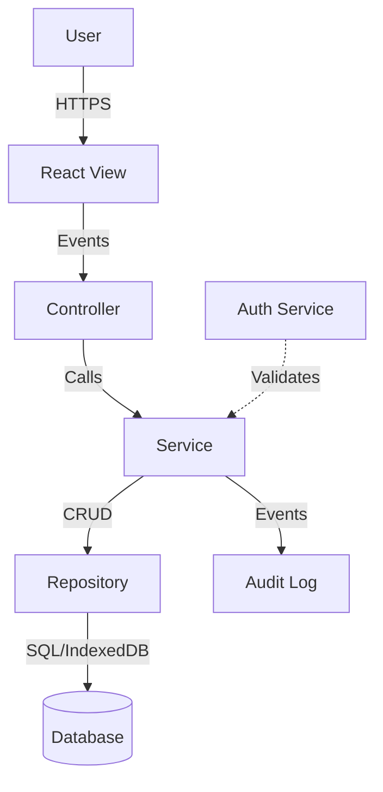

# SAQI-021: Apéndice E — Modelos de Amenaza (Threat Models)

**Versión:** 1.0
**Fecha:** 2026-07-17
**Estado:** Borrador inicial
**Autor:** Adónis Adonai Gómez Martínez

---

## 1. Introducción

Este documento define los **modelos de amenaza base** utilizados en la fase de QA Adversarial (Fase 7, categoría ATK-SEC) y como entrada para el diseño de Skills de seguridad (`A-secure-coding`, `B-authentication-security`).

Metodología: **STRIDE** (Microsoft) aplicado a cada módulo/flujo crítico, complementado con **OWASP ASVS 4.0** niveles 1-2.

---

## 2. Modelo de Amenaza General: Open-RootERP (Offline ERP)

### 2.1 Contexto del Sistema

| Atributo | Valor |
|----------|-------|
| **Tipo** | SPA offline-first (PWA) |
| **Arquitectura** | MVC + Repository + Service + IndexedDB (Dexie) |
| **Autenticación** | Local (PBKDF2-SHA512, JWT en localStorage, RBAC 30 perms) |
| **Datos** | 100% cliente (IndexedDB), sin backend actual |
| **Sincronización** | Queue local para futuro backend (last-write-wins + manual conflicts) |
| **Usuarios** | Pequeños negocios, 1-5 usuarios concurrentes |
| **Entorno** | Navegador moderno (Chrome/Firefox/Safari/Edge), desktop + móvil |

### 2.2 Activos Críticos

| Activo | Clasificación | Impacto Compromiso |
|--------|---------------|-------------------|
| **Credenciales usuario** (hash PBKDF2) | Crítico | Alto — Acceso total al ERP |
| **Datos transaccionales** (ventas, compras, inventario) | Crítico | Alto — Pérdida financiera, legal |
| **Datos contables** (asientos, balance, PyL) | Crítico | Muy Alto — Auditoría, cumplimiento |
| **Configuración negocio** (impuestos, moneda, nombre) | Alto | Medio — Operatividad |
| **Logs de auditoría** | Alto | Medio — Trazabilidad, forense |
| **Código aplicación** (SPA) | Medio | Bajo — Cliente, verificable |

### 2.3 Actores de Amenaza

| Actor | Motivación | Capacidad | Acceso |
|-------|------------|-----------|--------|
| **Usuario malicioso interno** | Fraude, robo datos, sabotaje | Media (acceso app, conocimientos negocio) | Autenticado (rol limitado) |
| **Atacante externo (web)** | XSS, robo sesión, CSRF | Alta (herramientas automatizadas) | No autenticado → Autenticado |
| **Atacante con acceso físico** | Extracción IndexedDB, localStorage | Alta (DevTools, filesystem) | Dispositivo desbloqueado |
| **Malware/Extensión navegador** | Keylogging, DOM scraping, storage theft | Muy alta | Contexto navegador |
| **Usuario descuidado** | Errores, clicks accidentales, datos mal formados | Baja | Autenticado |

---

## 3. Análisis STRIDE por Módulo/Flujo

### 3.1 Autenticación y Sesión (Auth Module)

| Amenaza STRIDE | Escenario | Mitigación Implementada | Prueba Adversarial (ATK-SEC) |
|----------------|-----------|------------------------|------------------------------|
| **S**poofing | Login con credenciales robadas | PBKDF2-SHA512 (100k iter, salt 32B), mensajes genéricos | X1: Credenciales débiles, X2: 30 intentos fuerza bruta |
| **T**ampering | Modificar token JWT en localStorage | Validación expiración + firma en cada request sensible | X10: Token inválido, X10: Token expirado manual |
| **R**epudiation | Usuario niega acción realizada | Logs de auditoría inmutables (accountingEntries) | Verificar logs no modificables |
| **I**nformation Disclosure | Fuga hash/contraseña en logs/errores | Mensajes genéricos ("Usuario o contraseña incorrectos"), no logs sensitivos | X9: localStorage datos maliciosos |
| **D**enial of Service | Bloqueo cuenta por intentos fallidos | Bloqueo temporal configurable, cleanup automático | X7: 30 intentos fuerza bruta |
| **E**levation of Privilege | Escalada rol Vendedor → Admin | RBAC checks en **Service Layer**, no View; tokens validados cada request | U10: Modificar roleId en localStorage |

### 3.2 Ventas (Money Flow Crítico)

| Amenaza STRIDE | Escenario | Mitigación | Prueba ATK-SEC |
|----------------|-----------|------------|----------------|
| **S**poofing | Venta sin cliente (ocasional) | Validación Service: cliente opcional pero validado | SA11: Cliente ocasional auto-creado |
| **T**ampering | Modificar precio/cantidad en carrito | Validación Service: precios desde BD, stock atómico | SA6: Precio negativo, SA5: Qty > stock |
| **T**ampering | Double-click "Guardar Venta" | Botón deshabilitado tras primer click + idempotency key | SA15: Double-click rápido |
| **T**ampering | Race condition stock (2 tabs misma venta) | Transacción Dexie atómica multi-tabla + helper `_executeAdjustment` | SA28: Ventas concurrentes mismo producto |
| **R**epudiation | Anular venta sin dejar rastro | Anulación crea asiento inverso + movement ajuste | SA20: Cancelación stock restoration |
| **I**nformation Disclosure | XSS en notas venta | Sanitización `sanitizer.escapeHtml` en render | X1: XSS stored en nombre producto |
| **D**enial of Service | Venta con 100 líneas (performance) | DocumentFragment batch render, paginación | SA26: 100 line items |
| **E**levation | Vendedor anula venta (sin permiso) | Check `sales.cancel` en Service, UI oculta botón | U9: URL directa /sales/cancel |

### 3.3 Importación/Exportación (Alto Riesgo Integridad)

| Amenaza STRIDE | Escenario | Mitigación | Prueba ATK-SEC |
|----------------|-----------|------------|----------------|
| **T**ampering | Prototype pollution via `__proto__` en JSON | `ImportService._sanitizeRecord` elimina `__proto__`, `constructor.prototype` | X6, X7: Prototype pollution |
| **T**ampering | CSV Formula Injection (`=2+5`, `=HYPERLINK`) | Prefijo `'` en exportación celdas que empiezan `=`, `+`, `-`, `@` | X5: CSV Formula Injection |
| **T**ampering | XSS en nombre producto importado | `sanitizeRecord` + `escapeHtml` en render | IM5: XSS en CSV import |
| **I**nformation Disclosure | Fuga datos sensibles en export | Export solo datos negocio; no tokens, hashes, sessions | Verificar export no incluye auth data |
| **D**enial of Service | CSV 100MB / 50k filas | Streaming parse, chunked, progress, cancel | IM1: 100MB, IM3: 50k rows |
| **E**levation | Importar proveedores como clientes | Auto-detect v2: weighted scoring + tiebreaker documentId | IM12: Entity mismatch, IM13: Cancel mid-process |

### 3.4 Almacenamiento Offline (IndexedDB + SW)

| Amenaza STRIDE | Escenario | Mitigación | Prueba ATK-SEC / ATK-CHAOS |
|----------------|-----------|------------|----------------------------|
| **T**ampering | Corrupción IndexedDB manual | Dexie transacciones ACID; versión schema migraciones | O6: DB corrupta |
| **T**ampering | Quota exceeded (llenar storage) | Manejo error `QuotaExceededError`; limpieza guiada | O5: Quota exceeded |
| **I**nformation Disclosure | Acceso IndexedDB desde otra pestaña/usuario | Same-origin policy; no datos sensitivos en claro (hashes only) | O7: Multi-tab stale data |
| **D**enial of Service | SW cache corrupto | SW self-heal: `caches.delete()` + re-register | O4: Cache corrupted |
| **E**levation | Modificar datos en DevTools | Validación Service layer en cada operación | O2: Edit offline → sync online |

### 3.5 RBAC y Permisos

| Amenaza STRIDE | Escenario | Mitigación | Prueba ATK-SEC |
|----------------|-----------|------------|----------------|
| **E**levation | Vendedor accede /users vía URL directa | Check `users.view` en **Service**, redirect en Router | U9: Direct URL to admin module |
| **E**levation | Modificar roleId en localStorage a Admin | Token JWT firmado + validación Service; roleId no confiable client-side | U10: Modify roleId in localStorage |
| **S**poofing | Usuario se hace pasar por otro | Session token único + validación expiración + PBKDF2 | A11: Concurrent login 2 browsers |
| **T**ampering | Desactivar usuario admin (último admin) | Bloqueo en Service: no permitir desactivar último admin | U6: Delete self |

---

## 4. Matriz de Cobertura ATK-SEC (Fase 7)

| ID Escenario ATK-SEC | STRIDE Cubierto | Módulo | Criticidad |
|----------------------|-----------------|--------|------------|
| **X1** | Stored XSS producto | T, I | Productos | Crítica |
| **X2** | Stored XSS dirección cliente | T, I | Clientes | Crítica |
| **X3** | Reflected XSS búsqueda | T, I | Global | Alta |
| **X5** | CSV Formula Injection | T | Export | Alta |
| **X6** | Prototype pollution `__proto__` | T, E | Import | Crítica |
| **X7** | Prototype pollution `constructor.prototype` | T, E | Import | Crítica |
| **X9** | localStorage datos maliciosos | I, E | Auth/Storage | Media |
| **X10** | Token sesión inválido | S, T | Auth | Alta |
| **XSS_EXTRA** | SVG onload proveedor | T, I | Proveedores | Alta |
| **A1-A20** | Auth scenarios (fuerza bruta, token manip, RBAC bypass) | S, T, R, I, D, E | Auth | Crítica |
| **SA1-SA28** | Sales adversarial (double submit, stock race, XSS, anulación) | T, R, E | Ventas | Crítica |
| **PU1-PU9** | Purchases adversarial | T, R, E | Compras | Alta |
| **IM1-IM20** | Import/Export adversarial | T, I, D, E | Import/Export | Crítica |

---

## 5. Threat Models para Otros Stacks (Plantillas)

### 5.1 SaaS Online (React + Node/Express + PostgreSQL)

| Componente | Amenazas Adicionales vs Offline |
|------------|--------------------------------|
| **API REST/tRPC** | Rate limiting, JWT validation, CORS, input validation (Zod), API versioning |
| **Base de Datos** | SQL Injection (parametrized queries), RLS (Row Level Security), encryption at rest |
| **Autenticación** | OAuth2/OIDC, refresh token rotation, MFA, session management server-side |
| **Autorización** | RBAC/ABAC en middleware, policy engine (OPA/Cedar), audit logging centralizado |
| **Red** | TLS 1.3, HSTS, CSP estricto, subresource integrity, WAF |
| **Infraestructura** | Secrets management (Vault/AWS Secrets), container scanning, IaC scanning |

### 5.2 Mobile Offline-First (React Native + SQLite + Sync)

| Componente | Amenazas Específicas |
|------------|---------------------|
| **Almacenamiento local** | SQLCipher encryption, key management (Keychain/Keystore), secure deletion |
| **Sincronización** | Conflict resolution (CRDT/operational transform), auth sync, delta sync |
| **Autenticación** | Biometría + PIN, token storage seguro, certificate pinning |
| **Código** | Code obfuscation, anti-tamper, root/jailbreak detection |
| **Red** | Certificate pinning, mTLS, offline queue encryption |

### 5.3 Backend Microservicios (Go/Rust + gRPC + Kafka + PostgreSQL)

| Capa | Amenazas Clave |
|------|----------------|
| **Service Mesh** | mTLS, authZ policies, traffic encryption, observability |
| **API Gateway** | Rate limiting, authN/authZ centralizada, request validation, circuit breaker |
| **Datos** | Event sourcing integrity, saga pattern compensation, PII encryption, GDPR compliance |
| **Despliegue** | SBOM, image signing, admission policies, runtime security (Falco) |

---

## 6. Plantilla de Threat Model por Módulo (Para Fase 2 Architect)

```markdown
# THREAT MODEL — [MODULE NAME]

**Módulo:** [Nombre]
**Versión:** 1.0
**Fecha:** YYYY-MM-DD
**Autor:** [Security Engineer / TL]

---

## 1. Data Flow Diagram (DFD)
[Mermaid/PlantUML diagram showing: External Entities, Processes, Data Stores, Data Flows, Trust Boundaries]



---

## 2. Trust Boundaries

| Boundary | Descripción | Controles |
|----------|-------------|-----------|
| **Client/Server** | Navegador ↔ API | TLS, CSP, CORS, CSRF tokens |
| **Auth Boundary** | Unauth → Auth | JWT validation, session management |
| **Data Boundary** | Service → DB | Parameterized queries, RLS, encryption |
| **Admin Boundary** | User → Admin | RBAC checks, audit logging |

---

## 3. STRIDE Analysis Table

| # | Componente | S | T | R | I | D | E | Mitigación | Prueba ATK-SEC |
|---|------------|---|---|---|---|---|---|------------|----------------|
| 1 | Login Form | ☑ | ☑ | ☐ | ☑ | ☑ | ☑ | PBKDF2, rate limit, generic errors | X1-X10 |
| 2 | Sale Creation | ☐ | ☑ | ☑ | ☐ | ☑ | ☑ | Atomic tx, validation, idempotency | SA1-SA28 |
| ... | ... | ... | ... | ... | ... | ... | ... | ... | ... |

---

## 4. Risk Rating (DREAD o CVSS)

| Amenaza | Damage | Reproducibility | Exploitability | Affected Users | Discoverability | Score | Prioridad |
|---------|--------|-----------------|----------------|----------------|-----------------|-------|-----------|
| XSS Stored en Producto | 9 | 8 | 7 | 10 | 6 | 8.0 | Crítica |
| Prototype Pollution Import | 8 | 7 | 9 | 8 | 5 | 7.4 | Crítica |
| Race Condition Stock | 7 | 6 | 6 | 5 | 4 | 5 | 5.6 | Alta |
| ... | ... | ... | ... | ... | ... | ... | ... |

---

## 5. Mitigaciones y Pruebas

| Mitigación | Implementación | Verificación (ATK-SEC) | Responsable |
|------------|----------------|------------------------|-------------|
| Sanitización entrada | `sanitizer.ts` + Zod schemas en puertos | X1, X2, X3, X5, IM5 | Dev + QA |
| Transacciones atómicas | Dexie `db.transaction('rw', ...)` | SA14, SA28, PU5 | Dev |
| RBAC en Service Layer | `PermissionService.hasPermission()` | U9, U10, SA22 | Dev + Security |
| Rate limiting login | `SessionService` + config | A7, A15 | Dev |
| CSP estricto | `index.html` meta + SW headers | X1, X2, X3 | DevOps |

---

## 6. Residual Risk Acceptance

| Amenaza Residual | Justificación Aceptación | Monitoreo |
|------------------|-------------------------|-----------|
| XSS via SVG upload (proveedores) | SVG sanitization compleja; riesgo bajo (proveedores trusted) | Escaneo periódico |
| Timing attack en login | Mitigado parcialmente (generic messages); riesgo bajo | Log analysis |

---

## 7. Referencias

- OWASP Threat Modeling Guide
- Microsoft STRIDE
- OWASP ASVS 4.0.3
- NIST SP 800-218 (SSDF)
- ISO/IEC 27005:2018 (Risk Management)